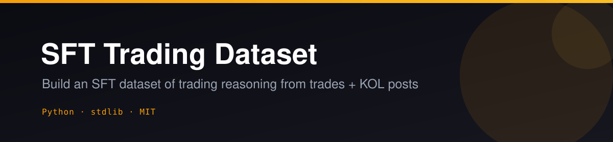
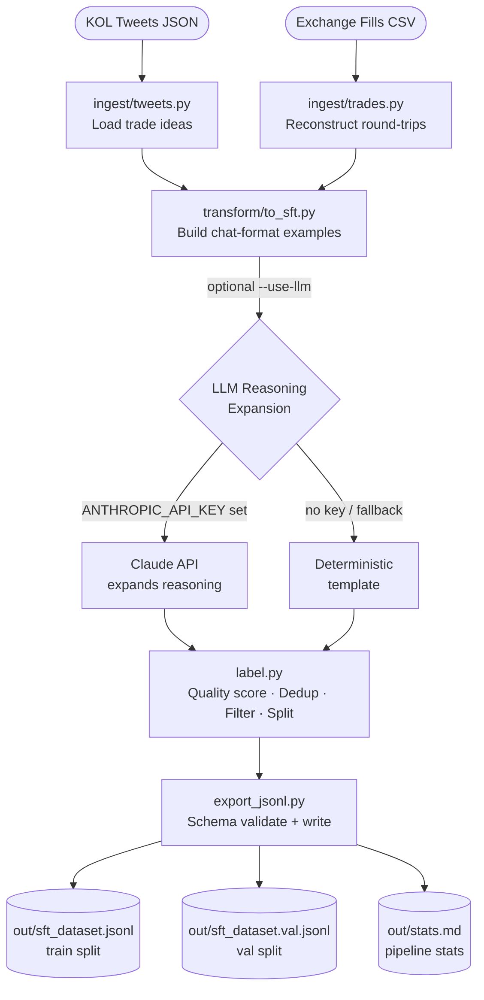

<p align="center"></p>

<p align="center">
  <a href="LICENSE"></a>
  
  
  
  
</p>

# 🧠 SFT Trading Dataset

**Turn raw trades and KOL posts into a ready-to-train SFT dataset of trading reasoning — in a single command.**

Feed the pipeline your exchange fill exports and/or KOL tweet archives; it automatically structures each trade into a `system / user / assistant` chat example with a reasoned thesis, numeric risk/reward levels, and a structured decision. The outcome (PnL / verdict) is stored as quality-filter metadata only — never leaked into the model's input. Zero mandatory dependencies: the full pipeline runs on Python's standard library, with an optional LLM call to expand terse tweets into richer reasoning traces.

---

## ✨ Features

- **Zero required dependencies** — pure Python stdlib pipeline; `pip install` nothing to get started
- **Dual ingestion** — load from KOL tweet JSON archives *and/or* exchange fill CSVs in a single pass
- **Round-trip trade reconstruction** — groups raw fills into VWAP-based round-trips with fee-inclusive PnL and holding-period calculation
- **Composite quality scoring** — each example scored `[0, 1]` on outcome verdict, source tier, level specificity, and reasoning depth
- **Near-duplicate deduplication** — hash-based dedup on `(instrument, date, direction, source)` before the train/val split
- **Time-ordered train/val split** — most recent examples go to val; no random leakage across time
- **Optional LLM reasoning expansion** — pass `--use-llm` to expand terse tweets into structured 150-300 word reasoning traces via Claude (or any OpenAI-compatible endpoint); falls back to a deterministic template without a key
- **JSON Schema validation** — every output line is validated against `schema/sft-example.schema.json` before writing
- **Outcome as metadata only** — realized PnL / verdict attached for filtering, never included in the model's input context
- **Interoperable schema** — tweet format is shared with the companion `kol-distill-trader` repo

---

## 🎬 How it works



---

## 🚀 Quickstart

```bash
# 1. Clone
git clone https://github.com/Alchemist-X/sft-trading-dataset.git
cd sft-trading-dataset

# 2. Run the demo (no API keys, no pip install)
python3 main.py --demo
```

Output lands in `out/`:

| File | Description |
|------|-------------|
| `out/sft_dataset.jsonl` | Train split — one JSON object per line |
| `out/sft_dataset.val.jsonl` | Val split (newest 15% by timestamp) |
| `out/stats.md` | Pipeline run statistics |

### Use your own data

```bash
# KOL tweets only
python3 main.py --tweets path/to/kol_tweets.json

# Trade fills only
python3 main.py --trades path/to/trades.csv

# Both sources together
python3 main.py --tweets path/to/kol_tweets.json --trades path/to/trades.csv
```

### Filtering and quality controls

```bash
# Keep only high-R trades and bump the quality floor
python3 main.py --demo --min-r 1.5 --min-quality 0.5

# Exclude losing trades from the training set
python3 main.py --demo --no-keep-losers

# Expand tweet reasoning with an LLM (Claude by default)
python3 main.py --demo --use-llm
```

### All flags

| Flag | Default | Description |
|------|---------|-------------|
| `--demo` | — | Use bundled sample data |
| `--tweets PATH` | — | KOL tweets JSON file |
| `--trades PATH` | — | Exchange fill history CSV |
| `--out-dir DIR` | `./out` | Output directory |
| `--min-r FLOAT` | none | Minimum R-multiple filter |
| `--keep-losers` / `--no-keep-losers` | keep | Include/exclude LOSS examples |
| `--min-quality FLOAT` | `0.0` | Minimum quality score `[0, 1]` |
| `--val-fraction FLOAT` | `0.15` | Fraction of examples for val split |
| `--use-llm` | off | LLM-assisted reasoning expansion |

---

## ⚙️ Configuration

Copy the example env file and fill in what you need:

```bash
cp .env.example .env
```

| Variable | Required | Description |
|----------|----------|-------------|
| `ANTHROPIC_API_KEY` | No | Claude API key for `--use-llm` reasoning expansion. Without it a deterministic template is used — always produces valid examples. |
| `TWITTER_BEARER_TOKEN` | No | Twitter v2 Bearer Token for live KOL tweet fetching. Without it, load from a local JSON file. |

### OpenAI-compatible LLM support

The reasoning expansion step calls the Anthropic API by default, but the code in `transform/to_sft.py` is straightforward to point at any OpenAI-compatible endpoint (Kimi/Moonshot, local Ollama, etc.) by swapping the base URL and model name — the prompt format is provider-agnostic.

### Trade CSV format

The fills CSV must have these columns (standard exchange export format):

```
timestamp, symbol, side, price, qty, fee, pnl, order_type
```

The pipeline groups fills into round-trip trades via position netting and computes VWAP entry/exit, fee-inclusive PnL, holding period, and win/loss verdict automatically.

### KOL tweet JSON format

```json
{
  "id": "...",
  "author": "KOL Name",
  "handle": "@handle",
  "timestamp": "2025-10-12T06:30:00Z",
  "text": "BTC long at 61200, target 63500, stop 60400",
  "trade": {
    "symbol": "BTC/USDT",
    "direction": "long",
    "entry": 61200,
    "target": 63500,
    "stop": 60400,
    "size": 5.0
  },
  "reasoning": "Liquidity sweep done, CME gap above...",
  "media": []
}
```

See `sample/kol_tweets.json` for a complete example.

---

## 📐 SFT Example Schema

Each JSONL line conforms to `schema/sft-example.schema.json`. Key fields:

```jsonl
{
  "id": "uuid-v4",
  "version": "1.0",
  "split": "train",
  "source": "kol_post",
  "market": "crypto",
  "instrument": "BTC/USDT",
  "system_prompt": "You are a disciplined, process-driven cryptocurrency trader...",
  "context": "Asset: BTC/USDT\nKOL setup posted by ...",
  "reasoning": "**Market Structure Read:**\n...\n**Risk/Reward Assessment:**\n...",
  "decision": {
    "direction": "LONG",
    "entry_zone": [61200.0],
    "invalidation": 60400.0,
    "targets": [63500.0],
    "position_size_pct": 5.0,
    "confidence": 4
  },
  "outcome": { "realized_pnl_pct": 3.55, "verdict": "WIN" },
  "quality_score": 0.82,
  "tags": ["bullish-bias", "structured-setup", "liquidity-grab"]
}
```

> `outcome` is metadata only — it is never passed to the model at inference time.

### Quality score breakdown

| Signal | Weight | Notes |
|--------|--------|-------|
| Outcome verdict (WIN / SCRATCH / LOSS) | 0.35 | WIN=1.0, SCRATCH=0.6, LOSS=0.5, missing=0.3 |
| Source tier | 0.25 | `own_journal`=1.0, `kol_post`=0.7, `on_chain`=0.6 |
| Specificity (entry + stop + target present) | 0.25 | 3/3 levels = 1.0 |
| Reasoning depth (word count proxy) | 0.15 | Target 50–400 words |

---

## 🗺️ Roadmap / Needs

The core pipeline is working end-to-end. Here is what would make it significantly more useful:

- [ ] **Real Twitter/X ingest adapter** — `ingest/tweets.py` exposes a `TwitterFetcherInterface`; a concrete implementation using the v2 API would unlock live data collection
- [ ] **Own-journal source** — highest-quality training signal (`source_tier = 1.0`); a loader for personal trade journal formats (Notion export, CSV, etc.) would be straightforward to add
- [ ] **Semantic dedup** — current dedup is hash-based on `(instrument, date, direction)`; embedding-based near-duplicate detection would improve dataset quality further
- [ ] **More asset classes** — the schema is market-agnostic; adding equity or futures loaders would widen applicability
- [ ] **Fine-tuning guide** — a short walkthrough of taking `sft_dataset.jsonl` through a LoRA fine-tune run (Unsloth / Axolotl) would complete the end-to-end story

Contributions are welcome — see the pluggable interfaces in `ingest/tweets.py` for where to start.

---

## 📁 Project Structure

```
sft-trading-dataset/
├── main.py                      # Pipeline orchestrator (entry point)
├── label.py                     # Quality scoring, dedup, train/val split
├── export_jsonl.py              # Schema validation + JSONL writer
│
├── ingest/
│   ├── tweets.py                # KOL tweet loader + pluggable fetcher interface
│   └── trades.py                # Exchange fill CSV loader → round-trip trades
│
├── transform/
│   └── to_sft.py                # Convert trade ideas / trades → SFT chat examples
│
├── sample/
│   ├── kol_tweets.json          # Bundled sample KOL tweets (fictional)
│   └── trades.csv               # Bundled sample trade history
│
├── schema/
│   └── sft-example.schema.json  # JSON Schema for one training example
│
├── assets/
│   └── banner.svg               # Repo banner
│
├── .env.example                 # Environment variable template
└── SPEC.md                      # Full design specification and methodology
```

---

## ⚖️ Legal / ToS Notice

**Twitter/X:** ToS prohibits bulk scraping. Use only the official v2 API with a valid Bearer Token.

**KOL content copyright:** Posts by third-party analysts are copyrighted by their authors. Obtain explicit consent before using KOL content for commercial model training.

**LLM-generated content:** Claude-generated reasoning traces are subject to Anthropic's usage policies. Review current ToS before using LLM-generated content to train competing commercial models.

**Own trade history:** Fully safe — you own your trade records.

---

## 📄 License

MIT — see [LICENSE](LICENSE).

---

<p align="center">If this project saves you time, consider giving it a star. It helps others find it.</p>
